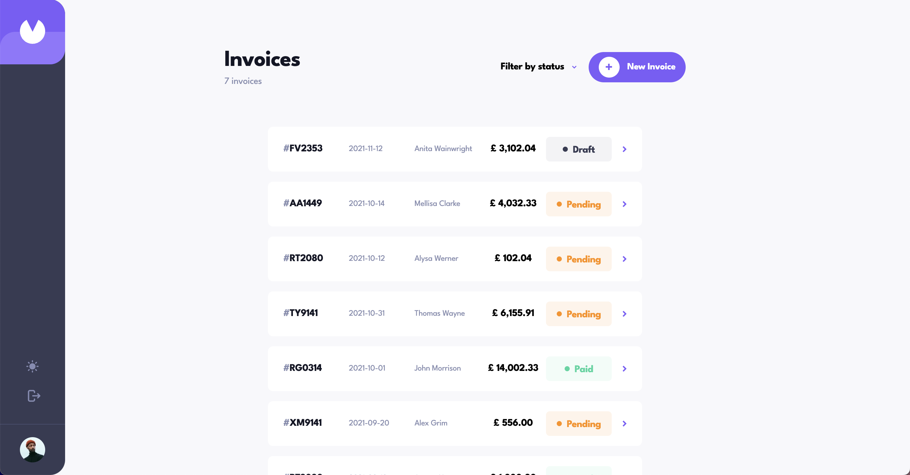

# Frontend Mentor - Invoice app solution

This is a solution to the [Invoice app challenge on Frontend Mentor](https://www.frontendmentor.io/challenges/invoice-app-i7KaLTQjl). Frontend Mentor challenges help you improve your coding skills by building realistic projects.

## Table of contents

- [Overview](#overview)
  - [The challenge](#the-challenge)
  - [Screenshot](#screenshot)
  - [Links](#links)
  - [Built with](#built-with)
  - [Continued development](#continued-development)
- [Author](#author)

## Overview

Invoice web app written using react and uses firebase db and authentication it runs in dark and light mode which can be toggled. User can create a new invoice, save it to draft, edit invoice, change invoice status and also filter them.

### The challenge

Users should be able to:

- View the optimal layout for the app depending on their device's screen size
- See hover states for all interactive elements on the page
- Create, read, update, and delete invoices
- Receive form validations when trying to create/edit an invoice
- Save draft invoices, and mark pending invoices as paid
- Filter invoices by status (draft/pending/paid)
- Toggle light and dark mode
- **Bonus**: Keep track of any changes, even after refreshing the browser (`localStorage` could be used for this if you're not building out a full-stack app)

### Screenshot

### Links

- Solution URL: [https://github.com/NikitaVologdin/React-Invoice-App](https://github.com/NikitaVologdin/React-Invoice-App)
- Live Site URL: [https://react-invoice-app-ten.vercel.app](https://react-invoice-app-ten.vercel.app)

### Built with

- Semantic HTML5 markup
- CSS custom properties
- Flexbox
- CSS Grid
- Mobile-first workflow
- [React](https://reactjs.org/) - JS library
- [React Router](https://reactrouter.com/) - React framework
- [Redux](https://redux.js.org/) - State manager
- [Tailwind](https://tailwindcss.com/) - For styles
- [Firebase](https://firebase.google.com/) - Database, Backend, Authentication
- [FinalForm](https://final-form.org/react) - Form handling

### Continues development

- Convert invoice to pdf on request and ability to download it
- Put a logo on the invoice
- Post invoice info to the accounting program

## Author

- Website - [Nikita Vologdin](https://vologdin.eu/portfolio)
- Frontend Mentor - [@NikitaVologdin](https://www.frontendmentor.io/profile/NikitaVologdin)
- Linkedin - [Nikita Vologdins](https://www.linkedin.com/in/nikitavologdins/)
